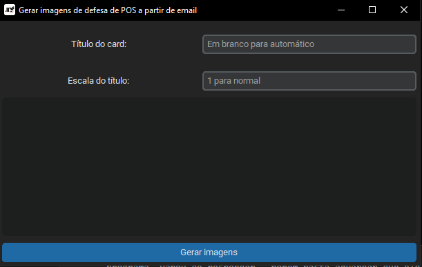
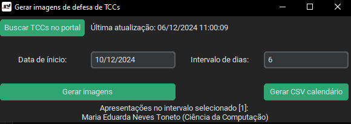

# DefesaFácil: Solução para criação de imagens de defesas de TCC, mestrado e doutorado.


**A fim de facilitar a divulgação das defesas de Mestrado, Doutorado e TCC por parte do Setor de Comunicação do INF/UFRGS (comunica@inf.ufrgs.br)**, foi desenvolvida uma ferramenta para gerar as imagens, com base nas artes criadas por Clarissa Taborda. Foi utilizado Python e, em especial, a biblioteca Pillow.  Para facilitar o uso dentro do Comunica, os arquivos são combinados em arquivo executável utilizando PyInstaller. 

## Defesas de Mestrado e Doutorado

As imagens para defesas de dissertações de Mestrado e Doutorado são geradas utilizando o programa _gerarImagensPOS_email_, que cria as imagens usando como base os dados dos e-mails enviados pela Secretaria do PPGC. Para usar, basta copiar o e-mail e colar no campo de texto da aplicação.


> O campo "Escala do título" recebe um número com vírgula e controla o tamanho do título. O valor 1 é o padrão, um valor menor que este deixa o título menor.

## Gerador para TCCs
Esta ferramente extrai os TCCs da página "Visão do Comuica - TCCs" utilizando as credenciais informadas no arquivo `credenciais.json`, localizado na mesma pasta do executável.


- A cada uso, clique no botão "Buscar TCCs no portal" para atualizar os dados.

> **Aviso:** ao buscar TCCs no portal o Windows pode alegar que o programa "Parou de responder", porém basta aguardar que ele está funcionando sim :\)

A ferramenta gera as imagens e o arquivo CSV para importação no site, utilizando o plugin mencionado anteriormente.

Conforme acordo entre a equipe do Comunica, o programa era executado semanalmente nas segundas-feiras para importar os novos TCCs e em seguida gerar os arquivos necessários para as redes sociais e site.

## Instruções de Uso

1. Clone este repositório:
    ```bash
    git clone https://github.com/dsadriel/defesa-facil.git
    cd defesa-facil
    ```
2. Crie e ative um ambiente virtual:
    ```bash
    python -m venv venv
    source venv/bin/activate  # No Windows, use: venv\Scripts\activate
    ```
3. Instale os requisitos necessários:
    ```bash
    pip install -r requirements.txt
    ```
4. Atualize o arquivo `credenciais.json` com as informações apropriadas.
5. Execute o programa conforme necessário.
    ```bash
    python gerarImagensPOS_email.py
    python ggerarImagensTCC_GUI.py
    ```

## Instruções de Compilação

1. Execute o arquivo `DIST.bat` para gerar o executável.

## Formato do arquivo `credenciais.json`

```json
{
    "portalServicosINF": {
        "__info": "Login e senha para acessar o portal do INF para pegar as informações dos TCCs",
        "login": "USUÁRIO",
        "senha": "SENHA-PORTAL"
    },
    "TinyURL": {
        "__info": "Chave de acesso para a API do TinyURL",
        "email": "E-MAIL",
        "token": "TOKEN-ACESSO"
    }
}

```